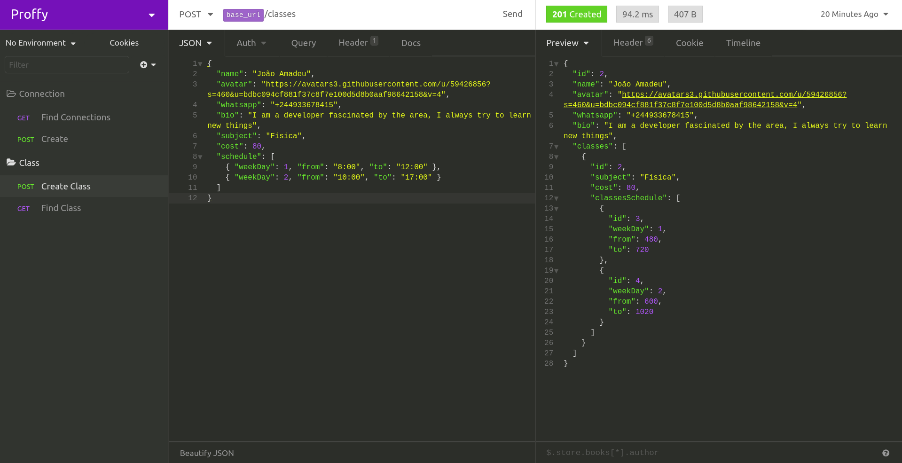

<h1 align="center">
  
</h1>

Application to join teachers and students for a strong connection and interaction.

<h4 align="center"> 
	🚧  Under development🚀...  🚧
</h4>

## :card_index: Layout

<div>

</div>

## :construction_worker: Installation

You will need to install

- [Node.js](https://nodejs.org)
- [Expo](https://yarnpkg.com/)
- [Yarn](https://yarnpkg.com/)

## Running the Project

```bash
$ git clone https://github.com/jmamadeu/proffy.git # Clone this repository to your machine
$ cd proffy # Enter in the project folder
```

### (Backend)Restful API

```bash
$ cd backend # Enter to the Restful api folder
$ yarn # Install all dependencies
$ yarn dev:server # Running the project
```

### (Frontend)Web

```bash
$ cd web # Enter to web frontend folder
$ yarn # Install all dependencies
$ yarn start # Running the project
```

### (Frontend)Mobile

```bash
$ cd mobile # Enter to the mobile frontend
$ yarn # Install all dependencies
$ yarn start # Running the project
```

:tada: Congratulations, the project is running. <br />
<strong> Att.: If you want to test routes, please copy the file `.github/Insomnia_2020-08-07.json` in the `Insomnia Application` [Insomnia](https://insomnia.rest/) </strong>

## :bulb: Contributing

Pull requests are welcome. For major changes, please open an issue first to discuss what you would like to change.

Please make sure to update tests as appropriate.

## :bookmark: License

[MIT](https://choosealicense.com/licenses/mit/)
